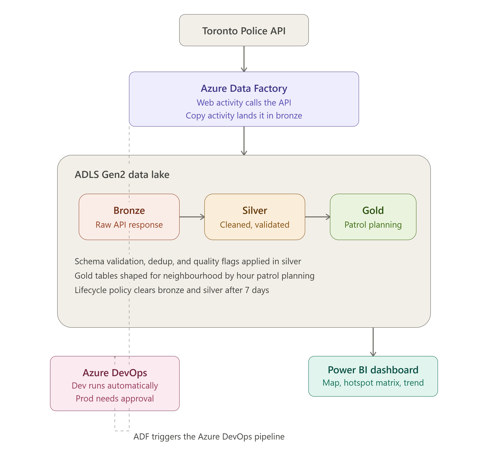
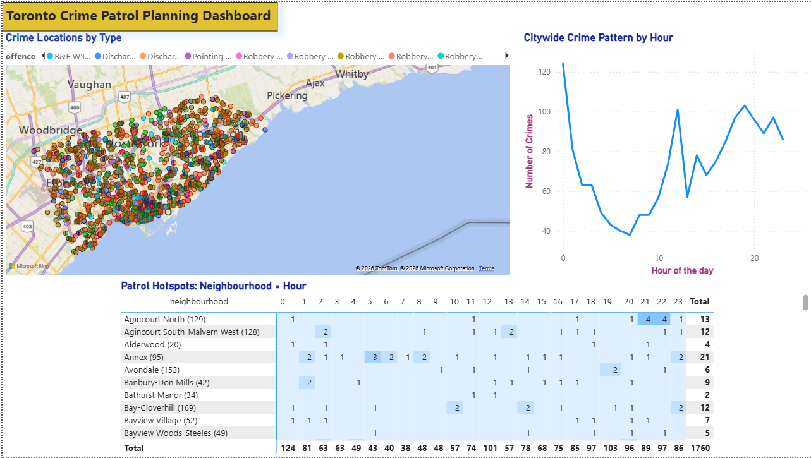
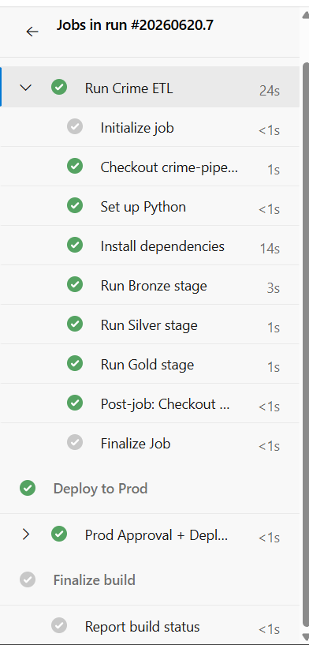
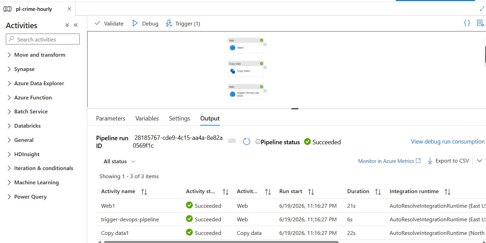

# Toronto Crime Data Pipeline

A production style data pipeline built on Azure, ingesting live Toronto Police crime data and transforming it into patrol planning insights. Built to learn and demonstrate the exact Azure stack (ADF, Databricks, ADLS Gen2, Azure DevOps) used by Azure based DevOps/BI platform teams.

**Live data source:** [Toronto Police Major Crime Indicators API](https://data.torontopolice.on.ca/datasets/TorontoPS::major-crime-indicators-open-data/) (approximately 474,000 records as of this writing)

## Architecture



Cross cutting pieces:
* Azure DevOps handles CI/CD: a Dev stage runs automatically, then a manual approval gate, then Prod.
* Secrets live in an Azure DevOps secure variable group (masked).
* A lifecycle policy automatically deletes bronze and silver files after 7 days.
* An Azure Monitor alert rule watches the ADF pipeline for failed runs and emails on failure.

## Why I built it this way (decisions and tradeoffs)

### Why three independent scripts instead of one notebook
`bronze.py`, `silver.py`, and `gold.py` are separate, and each reads its input from ADLS storage rather than from a shared Python variable. This means each stage is independently retryable, schedulable, and debuggable. If silver fails, I can fix and re run it without re fetching bronze. In a real environment, this is exactly the shape ADF would orchestrate as three chained activities. I deliberately designed for that handoff even though I couldn't fully wire it end to end.

### Why a live API instead of a static dataset
I started with a static historical CSV, then switched to live data specifically so I could prove the scheduling and automation parts of the stack actually work. A static file doesn't give you anything meaningful to schedule. The live Toronto Police API also let me build and verify a genuine duplicate detection step, since polling on a schedule produces real overlapping pulls.

### Why the medallion (bronze, silver, gold) pattern
Bronze keeps an untouched, auditable copy of every API response, which matters in a justice and policing context where you want a defensible record of exactly what was received. Silver applies validated, explicit cleaning rules. Gold is shaped specifically for the consumption pattern (Power BI, patrol planning), not for storage efficiency. For example, the fact table stays at full grain rather than pre aggregated, so the dashboard can drill into any dimension rather than being locked into pre computed slices.

## Production grade silver layer

Eight explicit data quality controls, not just formatting:

1. **Schema validation.** Fails loudly if the source API changes shape, rather than silently producing partial or wrong data.
2. **Explicit rename to snake_case.** A stable contract for downstream consumers, independent of the source API's naming.
3. **Type coercion with `errors="coerce"`.** Malformed values become null instead of crashing the run.
4. **Per field missing value policy.** For example, a missing `premises_type` becomes `"Unknown"` and is kept; a missing `event_id`, `offence`, `division`, or `report_date` causes the row to be dropped, and the count is logged.
5. **Duplicate detection.** Deduplicated on `event_id`, necessary because the scheduled API poll can return overlapping windows.
6. **Outlier and sanity checks.** Flags future dated records and out of range latitude, longitude, or hour values instead of silently trusting the source.
7. **Data quality flag column.** Flagged records are kept and labeled, not silently deleted, supporting auditability.
8. **Lineage and audit metadata.** Every row is stamped with its source and ingestion timestamp for traceability.

## Dashboard



The map shows individual incidents by location. The hotspot matrix shows neighbourhood by hour incident counts, shaded so the highest priority combinations stand out. The trend line shows the citywide pattern across the 24 hour day.

## CI/CD pipeline (Azure DevOps)

**Trigger:** any commit to `main`, plus a daily scheduled cron trigger.

**Dev stage:** installs dependencies, then runs `bronze.py`, then `silver.py`, then `gold.py` as three separate, separately logged steps.

**Prod stage:** gated behind a real manual approval check on the `production` environment. Verified twice, including catching and fixing a case where the approval gate silently stopped enforcing after a config change.

**Secrets:** stored in an Azure DevOps variable group (`TORONTO_API_URL`, `STORAGE_ACCOUNT_NAME`, `STORAGE_ACCOUNT_KEY`), masked, injected via YAML `env` blocks, and read in Python via `os.environ.get(...)`. None appear in committed code.



Bronze, silver, and gold run as three separate, separately logged steps in the Dev stage. Prod is gated behind a manual approval.

ADF lands fresh data in bronze and then directly triggers this pipeline through the Azure DevOps REST API, so the chain is event driven off real data arrival.



## Tech stack

| Layer | Tool |
| :-- | :-- |
| Storage | Azure Data Lake Storage Gen2 |
| Orchestration and scheduling | Azure Data Factory |
| Transformation | Python (pandas), developed in Databricks Free Edition |
| CI/CD | Azure DevOps Pipelines (YAML, multi stage) |
| Secrets | Azure DevOps variable groups (Key Vault provisioned, not yet linked) |
| Visualization | Power BI Desktop |
| Source control | Git (Azure DevOps Repos, mirrored here) |

## How to run

Infrastructure for this project is currently provisioned manually through the Azure Portal. I am working on Terraform modules to provision the resource group, storage account, ADLS containers, Data Factory, and the Azure DevOps variable group, so the whole environment can be stood up from code rather than by hand. Once that is in place, running this project will be:

1. `terraform apply` to provision the Azure resources
2. Set the pipeline secrets (`TORONTO_API_URL`, `STORAGE_ACCOUNT_NAME`, `STORAGE_ACCOUNT_KEY`) in the Azure DevOps variable group
3. Push to `main`, which triggers the Dev stage automatically
4. Approve the Prod stage when prompted

## Repository structure

```
.
notebook/
  adls_helpers.py      shared ADLS connection and read/write helpers
  bronze.py            API extraction, raw landing
  silver.py            validation, cleaning, dedup
  gold.py              patrol planning and Power BI ready tables
azure-pipelines.yml     multi stage CI/CD pipeline
architecture.png        architecture diagram
dashboard-full.png      Power BI dashboard screenshot
pipeline-run.png        Azure DevOps pipeline run screenshot
adf-trigger.png         ADF activity chain screenshot
README.md
```
